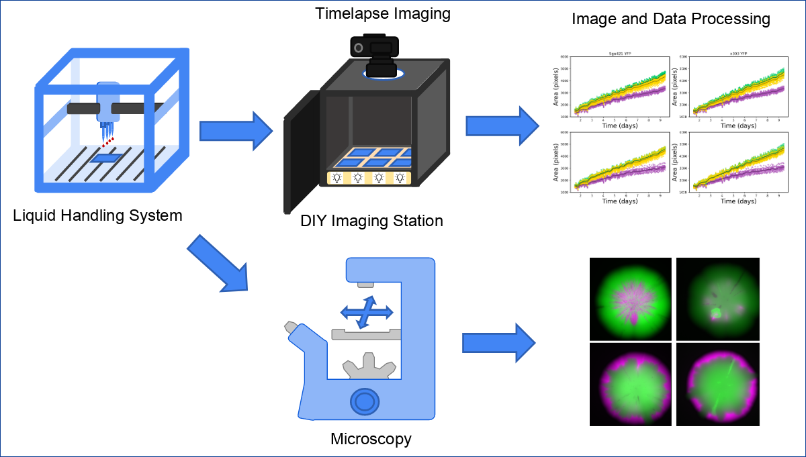

# Automated Yeast Strain Interaction Analysis Workflow

## Table of Contents

 [1. Overview](#overview)
 
 [2. Automated Sample Preparation](#sampleprep)
 
 [3. Image Acquisition](#acquisition)
 
 [4. Image Processing of Raw Images](#imageproc)
 
 [5. Citation](#citation)
 
 [6. License](#license)


 ## 2. Automated Sample Preparation <a name="sampleprep"></a>


## 1. Overview <a name="overview"></a>




This repository contains a complete automated pipeline for high-throughput analysis of microbial interactions on solid media. The workflow integrates three modular components: (1) **Sample Preparation** - Hamilton liquid handling protocols for automated strain mixing and plate inoculation, (2) **Time-lapse Imaging** - Raspberry Pi-controlled imaging station for colony growth monitoring, (3) image processing workflows to process the acquired images.(4)**Microscopy Analysis** - Automated fluorescence microscopy protocols to quantify strain distribution within mixed colonies. Together, these tools enable systematic investigation of pairwise strain interactions across different environmental conditions with minimal manual intervention.

### Repository Structure

- `1_Sample_Preparation/` - Hamilton liquid handling protocols (Venus 4)
- `2_Image_Acquisition/` - Raspberry Pi scripts for time-lapse photography
- `3_Image_Processing/` - Contains the python scripts to process the raw acquired images
- `Microscopy_Protocol/` - Automated microscopy acquisition methods

## 2. Automated Sample Preparation <a name="sampleprep"></a>


Automated Hamilton liquid handling protocols for high-throughput microbial interaction studies on solid media.

### Overview

This repository contains two Hamilton Microlab STAR protocols for preparing yeast strain interaction experiments:

1. **Mix and Dispense** - Automated mixing of strain pairs and distribution into 96-well plates
2. **Plating** - Automated transfer from liquid culture to solid agar plates using a custom pinning tool

These protocols enable systematic analysis of pairwise interactions between multiple yeast strains in different environmental conditions.

### System Requirements

- **Hamilton Microlab STAR/Starlet** liquid handling system
- **Venus 4** software (version 4.7.0.7744)
- **Hardware**: 4x 1000µL pipetting heads, CO-RE grippers
- **Custom pinning tool**: 96-pin array (0.8mm diameter steel pins, 1.5mm head)

### Protocol 1: Mix and Dispense

Automates the preparation of strain mixtures in defined ratios and distributes them into 96-well format.

**Key features**:
- User-defined mixing ratios via Excel worksheet
- Customizable plate layouts
- Automated liquid handling for replicates
- Simple UI for everyday lab use

**Files**:
- `Dispense.hsl` - Main protocol script
- `Dispense.lay` - Deck layout
- `Dispense.med` - Method file
- `Package/Dispense_v6.1_MethodsPaper_Compact.pkg` - Complete package
- `Manual/Mix_and_Dispence_Manual.pdf` - User manual

### Protocol 2: Plating (Colony Screening)

Transfers liquid cultures from 96-well plates onto solid agar media using a custom 96-pin stamping tool.

**Key features**:
- Custom pinning tool for precise inoculation
- Multiple immersion to prevent bubble formation
- Processes 3 plates per cycle
- Excel-based worklist configuration

**Files**:
- `colony_screening.hsl` - Main protocol script
- `colony_screening.lay` - Deck layout
- `colony_screening_systems_deck.lay` - System deck layout
- `colony_screening.med` - Method file
- `Package/2025.12.19_ColonyScreening_6_Methods_Compact.pkg` - Complete package
- `Manual/Plating_Manual.odp` - User manual (presentation format)


## 3. Image Acquisition <a name="acquisition"></a>

### Setting up RaspbianOS

1. **Update system**
sudo apt update && sudo apt upgrade -y

2. **Install system packages**
sudo apt install -y gphoto2 python3-w1thermsensor

3. **Install Python packages**
- Install pillow
pip3 install pillow sh

- Install DHT sensor library (requires force-pi flag)
pip3 install Adafruit_DHT --install-option="--force-pi"

- Edit /boot/firmware/config.txt and add at the end:
sudo nano /boot/firmware/config.txt

- dd these lines: (use your pin layout choice)
 "dtoverlay=w1-gpio,gpiopin=2"
 "dtoverlay=w1-gpio,gpiopin=3"
 "dtoverlay=w1-gpio,gpiopin=4"

4. **Reboot to apply changes**
sudo reboot


### Installing and Using the Script
1. Copy image acquisition script files from the project repo:
- image_acquisition_module.py
- acquire_timeseries.py

2. Verify hardware connections using terminal
- Check temperature sensors
"ls /sys/bus/w1/devices/"

- Check camera
"gphoto2 --auto-detect"

3. Configure measurement settings
Edit acquire_timeseries.py to set:
- measurementId: Experiment name
- temperatureSamplingTime: Temperature measurement interval (seconds)
- imageSamplingTime: Image capture interval (seconds)
- numImages: Total number of images to capture

4. Run the script
'python3 acquire_timeseries.py'

5. Follow progress in terminal output!


## 4. Image Processing of Raw Images <a name="imageproc"></a>


### 1. Calibration with `consoleCalibrator.py`

1. **Start the Calibrator**
   - Run `consoleCalibrator.py` from the command line:
     ```
     python consoleCalibrator.py <folder_with_timelapse_images>
     ```
   - If no folder is provided, you will be prompted to enter the path.

2. **Select a Base Image**
   - Browse through the images and select one where no colonies are visible (i.e., before colony growth starts).
   - Use the on-screen options to navigate and select the image.

3. **Choose Grayscale Conversion**
   - Select the grayscale method that best highlights the plate features (options: default, red, green, blue, average).
   - Preview the result and accept when satisfied.

4. **Adjust Plate Detection Parameters**
   - Modify parameters such as light equalization radius, plate border threshold, and plate distance threshold to ensure at least one blob (plate) is detected for each actual plate.
   - Use the preview to check detection results.

5. **Remove Extra Plates**
   - If extra blobs/plates are detected, remove them using the provided options until only the real plates remain.

6. **Set Plate Borders**
   - Adjust the border location range for each plate as needed.
   - If automatic detection is not accurate, use the manual adjustment option to set plate borders precisely.

7. **Assign Plate Layouts**
   - For each detected plate, assign the correct layout file (CSV) that describes the colony arrangement.
   - You can set layouts for all plates at once or individually.

8. **Select a Colony-Rich Image**
   - Choose an image with many visible colonies for row/column calibration.

9. **Calibrate Colony Grid Detection**
   - Adjust detection parameters so that each row and column of colonies is found.
   - Remove any extra rows or columns that do not correspond to real colonies.
   - Set the correct orientation for letter-number coding (e.g., A1 at top-left, letters horizontal/vertical as needed).

10. **Finish Calibration**
    - When all plates, rows, columns, and orientations are set, export the calibration.
    - A `calibration_results.json` file will be generated in your folder.

---

### 2. Full Analysis with `fullAnalysis.py`

1. **Run the Analysis Script**
   - Execute the following command:
     ```
     python fullAnalysis.py --images=<folder_with_timelapse_images> --data=calibration_results.json --output=output.csv
     ```
   - If you omit any argument, the script will prompt you for the missing information.

2. **Review Output**
   - The script will process all images, extract colony data, and write results to `output.csv`.
   - Each row in the CSV contains: Image, PlateID, ColonyID, ColonyDescriptor, Area, Circularity.

---

### Tips

- Always select a base image with no visible colonies for accurate plate detection.
- Use the preview windows to verify each step before accepting.
- If detection is not perfect, adjust parameters or use manual options.
- The calibration JSON file is essential for the analysis step—do not delete or modify it manually.

---

This workflow ensures accurate calibration and analysis of your cell colony growth experiment.

## 5. Citation <a name="citation"></a>

If you use this workflow in your research, please cite:

**[Title will be added upon publication]**  
Csaba Nagy, [Co-authors to be added]  
*[Journal name]*, [Year]  
DOI: [to be added]

BibTeX entry:
```bibtex
@article{nagy2025yeast,
  title={[Title to be added]},
  author={Nagy, Csaba and [Co-authors]},
  journal={[Journal name]},
  year={2025},
  doi={[DOI to be added]}
}
```

## 6. Licence <a name="license"></a>

MIT License

Copyright (c) 2025 Csikász-Nagy Lab

Permission is hereby granted, free of charge, to any person obtaining a copy
of this software and associated documentation files (the "Software"), to deal
in the Software without restriction, including without limitation the rights
to use, copy, modify, merge, publish, distribute, sublicense, and/or sell
copies of the Software, and to permit persons to whom the Software is
furnished to do so, subject to the following conditions:

The above copyright notice and this permission notice shall be included in all
copies or substantial portions of the Software.

THE SOFTWARE IS PROVIDED "AS IS", WITHOUT WARRANTY OF ANY KIND, EXPRESS OR
IMPLIED, INCLUDING BUT NOT LIMITED TO THE WARRANTIES OF MERCHANTABILITY,
FITNESS FOR A PARTICULAR PURPOSE AND NONINFRINGEMENT. IN NO EVENT SHALL THE
AUTHORS OR COPYRIGHT HOLDERS BE LIABLE FOR ANY CLAIM, DAMAGES OR OTHER
LIABILITY, WHETHER IN AN ACTION OF CONTRACT, TORT OR OTHERWISE, ARISING FROM,
OUT OF OR IN CONNECTION WITH THE SOFTWARE OR THE USE OR OTHER DEALINGS IN THE
SOFTWARE.

see [Licence File](LICENSE)
